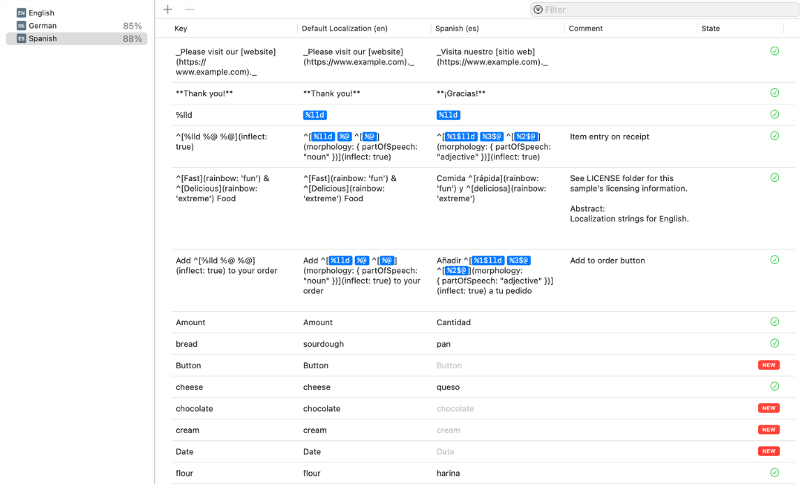
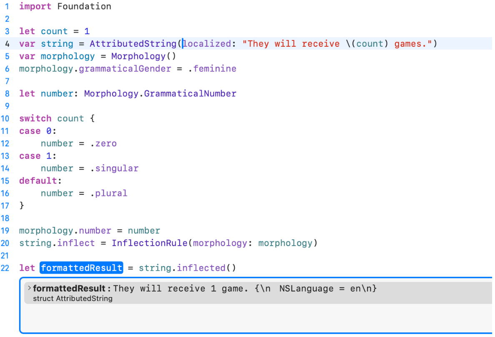

### Introduction

Apps that speak only one language are like tourists who don't know local customs. Localization bridges communication gaps, transforming user experiences across global markets.

### Expanding Your App to New Markets
Localization enables your app to reach a global audience, making it more discoverable and user-friendly for non-English speakers. A well-localized app demonstrates a **commitment to serving a diverse audience**, which helps establish brand trust and credibility. 

Benefits of expanding through localization include:
- Increased **user acquisition and retention**.
- Ability to **tap into new markets** without significant re-engineering.
- Improved **app store rankings** in localized regions.

### Improving Developer Experience
Using modern tools and frameworks for localization can streamline the development process, ensuring a smooth and efficient workflow. Many frameworks, including Swift and Flutter, offer robust localization support, making it easier for developers to integrate translations seamlessly.

By investing in a structured approach to localization, developers can:
- Avoid **hardcoded strings**, making future translations easier.
- Reduce the risk of **bugs** caused by incorrect formatting in different locales.
- Leverage **automated tools** to keep translations synchronized across updates.
---

## Understanding i18n vs L10n

### **Internationalization (i18n)**
- The process of **designing** an application so it can support multiple languages and regions **without requiring major code changes**.
- Ensures that text elements are **externalized**, meaning they are stored separately from the code.
- Supports **bidirectional text rendering** for languages like Arabic and Hebrew.
- Example: Using **Unicode** for encoding text, enabling support for multiple languages.

### **Localization (L10n)**
- The process of **adapting** an application for a specific language or region.
- Involves **translating text**, **adjusting date/time formats**, and **supporting different currencies**.
- Ensures that the app maintains **cultural relevance**.

---

### Localization File Formats:
#### String Files

### Characteristics
- Simple key-value pair format
- Plain text localization
- Limited pluralization support
- Basic translation mechanism

### Example
```
"greeting" = "Hello, %@!";
```

### Advantages
- Simple structure
- Wide tool compatibility
- Easy to read and edit
- Lightweight

### Disadvantages
- No built-in status tracking
- Manual pluralization management
- Limited device variation support
- No automatic synchronization

## Modern: `.xcstrings` Catalog



### Characteristics
- Structured localization management
- Native Xcode support
- Advanced translation features
- Comprehensive localization tracking


### Advantages
- Translation status tracking
- Automatic project synchronization
- Robust pluralization support
- Device-specific string variations
- Export/import for professional translation
- Visual editor in Xcode

### Disadvantages
- Newer format with limited third-party tool support
- Slightly more complex structure

---

## Formatting in Localization

Foundation framework provides a robust set of formatters that transform raw data into culturally appropriate representations.

### **Numbers Formatting**
Use `NumberFormatter` to format numbers, currencies, and percentages based on locale.

```swift
let formatter = NumberFormatter()

// Currency formatting across locales
formatter.numberStyle = .currency
formatter.locale = Locale(identifier: "en_US")
print(formatter.string(from: 1234.56) ?? "") // $1,234.56

formatter.locale = Locale(identifier: "de_DE")
print(formatter.string(from: 1234.56) ?? "") // 1.234,56 €
```

### **Date Formatting**
Use `Foundation` to correctly handle date and time formats based on locale. Incorrect date formats can lead to confusion and usability issues, particularly in regions with different calendar systems.

- **DateFormatter**: Format data using predefined styles (.short, .medium, .long, .full) or custom templates.

```swift
let formatter = DateFormatter()
let date = Date()

// Localized date styles
formatter.dateStyle = .long
formatter.locale = Locale(identifier: "en_US")
print(formatter.string(from: date)) // January 25, 2025

formatter.locale = Locale(identifier: "fr_FR")
print(formatter.string(from: date)) // 25 janvier 2025
```

- **DateIntervalFormatter**: Formats date intervals based on locale.

```swift
let formatter = DateIntervalFormatter()
let startDate = Date()
let endDate = Calendar.current.date(byAdding: .day, value: 7, to: startDate)!

formatter.locale = Locale(identifier: "en_US")
formatter.dateStyle = .long
print(formatter.string(from: startDate, to: endDate))
// January 25, 2025 – February 1, 2025
```

- **RelativeDateTimeFormatter**: Provides user-friendly relative time descriptions (e.g., “2 days ago”).

```swift
let formatter = RelativeDateTimeFormatter()

formatter.locale = Locale(identifier: "en_US")
print(formatter.localizedString(from: .now, to: .now.addingTimeInterval(3600))) 
// "in 1 hour"
```

- **DateComponentsFormatter**: Locale based date components manipulation
```swift
let formatter = DateComponentsFormatter()

// Flexible time interval formatting
formatter.allowedUnits = [.hour, .minute]
formatter.unitsStyle = .full
print(formatter.string(from: 3665) ?? "") // 1 hour, 1 minute
```

### **Measurements formatting**
Use `MeasurementFormatter` to handle unit conversions and localization without a hassle.

```swift
let formatter = MeasurementFormatter()
let celsius = Measurement(value: 25, unit: UnitTemperature.celsius)

formatter.locale = Locale(identifier: "en_US")
formatter.unitOptions = .naturalScale
print(formatter.string(from: celsius)) // 77°F
```
---

## Best Practices for Global App Development

### 1. Create Flexible Placeholders

Dynamic content placeholders are the secret to adaptable interfaces. They enable seamless text replacement without restructuring your entire app.

```swift
// Localization-ready approach
Button(String(localized: "purchase_button.title")) { }
```

### 2. Cultural Formatting Considerations

Different regions interpret data differently. Time, dates, and number representations vary widely across cultures.

```swift
let usLocale = Locale(identifier: "en_US")
let euroLocale = Locale(identifier: "de_DE")

let dateFormatter = DateFormatter()
dateFormatter.dateStyle = .short
dateFormatter.locale = usLocale   // Formats for US
dateFormatter.locale = euroLocale // Formats for Europe
```

### 3. String Management Strategies

Modern localization demands smart string handling. Move beyond static translations to dynamic, context-aware string management.

```swift
// Advanced pluralization
Text("^[\(itemCount) item](inflect: true)")
```

### 4. Advanced Localization Techniques: Morphology

Grammatical complexity varies across languages. Morphology helps automatically adapt text to linguistic nuances.



### 5. Code generation tools

Choose tools that streamline generating compile time constants for your localized strings:
- [SwiftGen](https://github.com/SwiftGen/SwiftGen)
- [R.swift](https://github.com/mac-cain13/R.swift)
- [xcstrings-tool](https://github.com/liamnichols/xcstrings-tool)

## Implementation Strategies

1. Extract all translatable text
2. Always use `Locale` for context-specific formatting
3. Test with multiple locale settings
4. Prefer system formatters over manual implementations
5. Consider cultural nuances in formatting

## Conclusion

Localization is more than translation - it's cultural empathy in code. Transform your app from local to global with intentional, user-centric design.


